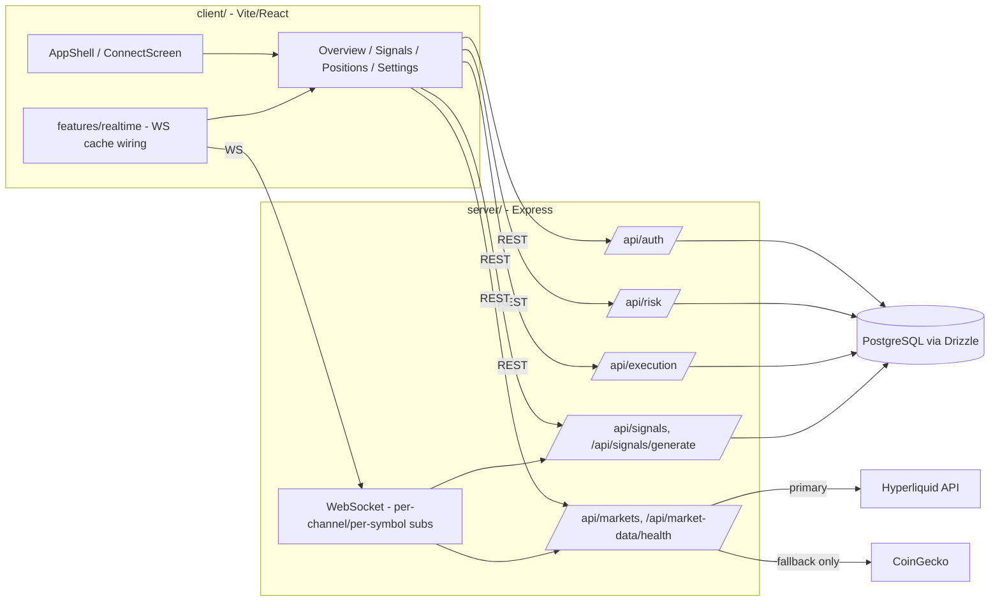

# Current-State Architecture — 2026-07-31

This documents what is actually implemented and wired together as of `origin/main`
(PR #17 merged), verified by reading route registration and directory structure directly
rather than inferring from `TARGET_ARCHITECTURE.md` (which is the *target*, written
2026-07-28 before most of the build-out below existed) or the README (stale — still says
"a client folder is not included in this repository").

## Runtime shape

Two independently deployed/built Node packages, no shared root workspace:

```
LiquidAlpha-github/
├── server/   Express 4 + ws, Drizzle ORM/PostgreSQL, Zod validation, vitest
└── client/   Vite 6 + React 18, TanStack Query, Radix/shadcn, Tailwind, wouter
```

## Deployment (`DEPLOY-001`, issue #30)

Two distinct modes, both driven by `server/src/server.ts`:

- **Development** (`npm run dev` in both packages, `NODE_ENV` unset): unchanged
  split-origin setup -- Vite serves the client on `:5173`, the API/WS server
  listens on `PORT` (default `3001`) for HTTP and a separate `WS_PORT`
  (default `8080`) for WebSocket upgrades. `CORS_ORIGIN` allows the client's
  dev origin to call the API cross-origin with credentials.
- **Production** (`NODE_ENV=production node dist/server.js`, after
  `npm run build` in both packages): single origin. The server serves
  `client/dist` as static files (hashed assets cached immutable, `index.html`
  no-cache), falls back unmatched non-`/api` GETs to `index.html` for SPA
  client-side routing, and the WebSocket server attaches to the same
  `http.Server` instance instead of opening its own port -- one public
  `PORT`, bound to `0.0.0.0`. Verified locally: root/API/SPA-fallback/404
  shapes, cache headers, and a real WS upgrade all confirmed working on the
  shared port; dev mode's split-origin behavior re-verified unaffected.

Replit-specific config/runbook is `REPLIT-READY-001`'s scope, built on top of
this.

## Server (`server/src/server.ts` entrypoint)

Middleware chain: CORS (explicit allow-list) → `express.json()` → `cookie-parser` →
`/api` rate limiter (`express-rate-limit`) → domain routers.

Mounted routers:
- `/api/auth` → `auth/router.ts` — wallet-signature auth (nonce issue/verify, session
  cookie, revocation), per migration step 5.
- `/api/risk` → `risk/` — limits and kill-switch domain (PR #13's own title says "not yet
  wired to execution" at the time it landed; **confirmed wired as of `origin/main`** —
  `execution/paperEngine.ts` calls `isGloballyHalted`/`isUserHalted` (kill switch),
  `getOrCreateRiskLimits`, and `evaluateTrade` before accepting an order, and rejects the
  order with the failure reason if the check fails. PR #14 completed the wiring PR #13
  left open.).
- `/api/execution` → `execution/` — paper-trading orders/positions with idempotency
  (`(user_id, idempotency_key)` unique constraint) and risk gating (PR #14).
  `PAPER-REALISM-001` (issue #39) added a documented, versioned fill-pricing
  model (`execution/fillModel.ts`): simulated fees (charged at entry and exit),
  real Hyperliquid funding accrual (`accruePaperFunding`, run every 5 minutes,
  using `fetchFundingHistory` -- not `getFundingRate`, verified broken against
  live Hyperliquid during implementation), and a per-position liquidation-price
  estimate. Every fill now records price source/timestamp, fill-model version,
  reference price, slippage, and fee (nullable for fills predating this
  feature). See `docs/architecture/paper-execution.md`.

Inline (not yet router-extracted) endpoints on `server.ts` directly:
- `GET /api/markets`, `GET /api/market-data/health`, `GET /api/markets/:symbol/candles`
  — market-data ingestion + staleness (`market-data/` module, PR #9; Hyperliquid made
  primary and CoinGecko demoted to an explicitly-labeled fallback as of `DATA-HL-001`,
  issue #34 — see `docs/architecture/market-data.md`). `runCandleBackfillCycle` backfills
  all four chart-supported intervals (1m/5m/15m/1h) as of `CHART-001` (issue #36) — it
  originally only backfilled 1m, found and fixed while building the chart UI that needed
  the other three. `DATA-RECOVERY-001` (issue #35) added a real shared Hyperliquid
  WebSocket connection (`hyperliquidWs.ts`) with reconnect/backoff and silent-stall
  detection, feeding a 1s per-symbol broadcast loop; `/api/market-data/health` now
  reports a `mode: live | degraded | fallback | unavailable` computed from combined
  WS + REST ingestion health (`marketHealth.ts`), and a new risk check
  (`checkTrustworthySource`) blocks any new paper order — including a resting limit
  order becoming marketable — from executing against a CoinGecko-fallback-sourced
  price.
- `GET /api/websocket/metrics` — connection/subscription observability for the WS layer
  (`websocket/` module, PR #11 — real per-channel/per-symbol subscriptions, not global
  broadcast).
- `GET /api/signals` (paginated, Zod-validated query), `POST /api/signals/generate`
  (Zod-validated body) — evidence-preserving signal engine (PR #12). Each generated
  signal now also carries an explainable "Signal strength" score (`SIGNAL-SCORE-001`,
  issue #37) — a deterministic, versioned 0-100 score with a six-component breakdown,
  conflict/invalidation detection, and freshness/availability tracking, computed by
  `signals/signalScore.ts` and stored in the nullable `signals.signal_score` jsonb
  column (null for signals generated before this feature shipped) — see
  `docs/product/signal-strength.md`.
- `GET /api/stats`, `GET /api/funding/:symbol` (Zod-validated params).

Cross-cutting: `middleware/requireAuth.ts`, `middleware/rateLimit.ts`,
`config/env.ts` (boot-time env validation, PR #5), `schemas/` (shared Zod contracts,
PR #6), `db/schema.ts` (Drizzle schema, hardened FKs/indexes/enums, PR #8).

## Client (`client/src/`)

- `app/App.tsx`, `app/AppShell.tsx`, `app/ConnectScreen.tsx` — auth-gated shell and
  wallet-connect entry (PR #15). `AppShell` is responsive as of `UI-RESP-001`
  (issue #29): the sidebar renders inline at `lg:` (1024px) and above, and
  collapses into an off-canvas drawer (`app/MobileNavDrawer.tsx`, built on
  `@radix-ui/react-dialog` for focus-trap/Escape/focus-restoration) below it.
  Verified at 390/768/1024/1440px with no horizontal overflow. Wallet connect is
  EIP-6963-based as of `WALLET-001` (issue #32) -- `ConnectScreen` lists every
  detected EVM provider by name (no more `window.ethereum`-only/last-injector-wins
  ambiguity). `ConnectScreen` also offers a no-wallet "Continue as Guest" path as of
  `AUTH-GUEST-001` (issue #33) -- a guest is a real server-managed session (`users`
  row with `kind: 'guest'`), not client-only state, and flows through the same
  risk-gated paper-execution path a wallet user's trades do. See
  `docs/architecture/wallet-and-identity.md`.
- `features/charts/` (`CHART-001`, issue #36) — BTC/ETH/SOL candlestick charts on
  `OverviewPage`, built on `lightweight-charts` (Apache-2.0, ~35kB, actively
  maintained, lazy-loaded into its own bundle chunk). `AssetCandlestickCard` composes
  `useLivePrice` (a selector over the existing `useMarkets()` cache, kept live by the
  one shared WS connection already mounted in `AppShell` -- not a second subscription)
  and `useCandles` (30s-refetched REST, matching the mission's "near real-time" degraded
  mode since no live candle WS push exists yet -- that's `DATA-RECOVERY-001`). Responsive:
  one chart + a symbol switcher below `md` (768px), all three at `md`+ (2-column, third
  spanning full width) and `xl`+ (1280px, three across). Both layouts render
  simultaneously in the DOM (CSS `hidden`/`md:hidden` toggles visibility, matching
  `AppShell`'s established pattern from `UI-RESP-001`) -- found during verification that
  this means BTC's card exists twice in the DOM at any viewport width (one
  `display:none`), each with an identical `aria-label`. Not a real accessibility
  problem (`display:none` elements are excluded from the accessibility tree) but worth
  knowing if a future automated test targets an interval/symbol control by aria-label
  alone -- it needs to also filter for the currently-visible instance.
- `routes/` — `OverviewPage`, `SignalsPage`, `PositionsPage`, `AnalyticsPage`,
  `SettingsPage` (+ `nav.ts` for route/nav config). `AnalyticsPage` (PR for
  `feat/analytics-integrity`, migration step 15) and `SettingsPage`'s risk-limits form
  (PR #25) were the two client surfaces still outstanding as of earlier revisions of
  this doc -- both now exist.
- `features/{auth,execution,markets,positions,realtime,risk,settings,signals}/` —
  feature-scoped hooks and logic (the pattern the migration plan explicitly modeled on
  Replit's `features/trade`/`features/markets` shape, minus the duplication issues
  found there).
- `features/realtime/` — WebSocket cache wiring into TanStack Query (PR #16), the
  mechanism by which live market/signal updates reach the UI without a second polling
  path.
- `components/ui/` — Radix + `class-variance-authority`/`tailwind-merge` design-system
  primitives (shadcn-style), reused across features rather than each feature owning its
  own controls.

## What is NOT yet true (do not assume otherwise)

**Update (2026-07-31):** the items originally listed here as gaps — observability, a
security test suite, and analytics integrity — were closed by PR #26 (`OBS-016`), PR #24
(`SEC-017`), and `feat/analytics-integrity` (`DATA-015`), each landed after this doc was
first written. Current gaps, re-verified as of this update:

- ~~No client test framework~~ — resolved by `TEST-CLIENT-001` (issue #31): `client/`
  now has Vitest + React Testing Library (`npm test`), Playwright/Chromium for a
  guest-screen smoke test + automated accessibility check (`npm run test:e2e`, not
  wired into CI yet -- deferred rather than adding a browser-binary install step
  speculatively), ESLint flat config (`npm run lint`), and Prettier (`npm run
  format`/`format:check`, applied once across existing `src/` as a mechanical,
  whitespace-only pass). CI's existing "if configured" checks pick up `lint`/`test`
  automatically, no workflow edit needed. Found and fixed one real defect in the
  process: `ink-muted` (`#726F8C`) was 3.81:1 against `bg-elevated`, below WCAG AA's
  4.5:1 — now `#807D98` (same hue, +5% lightness), 4.63:1.
- No lint configuration in the `server/` package — CI explicitly warns and skips
  (client now has one, see above).
- `server/src/performance.ts` is dead code, kept in place rather than deleted (nothing
  imports it; superseded by `server/src/analytics/`, which reads real closed trades from
  `positions` rather than the disconnected `performance` table this file used).

Now true (previously listed here as gaps, since resolved):
- Observability: structured logs, request IDs, `/api/health`/`/api/ready`,
  `/api/observability/metrics`, a WS connection-status indicator, and an error boundary
  all landed in PR #26 — see `docs/observability/strategy.md` and `signals.md`.
- Analytics integrity: `GET /api/analytics/performance` computes real, tiered metrics
  from closed paper trades only (never synthetic data) — see
  `server/src/schemas/analytics.ts` for the sample-size-tier contract, decided directly
  with the repo owner rather than invented.
- Security test suite: nonce replay/expiry, cross-user ownership (orders/positions), and
  rate-limit enforcement are regression-tested — see PR #24 and
  `docs/security/SECURITY_BASELINE.md`'s "Security Test Suite" section.
- (Risk-to-execution wiring was checked directly in `paperEngine.ts` and confirmed live
  — see above. Not a gap.)

## Diagram



Plain-language: the client never talks to Postgres, Hyperliquid, or CoinGecko directly —
everything routes through the Express API or the WebSocket layer, which is itself fed by
the market-data and signals modules. Auth, risk, and execution are separate routers so
that authorization and risk gating happen server-side before any order write, not as a
client-side check.
