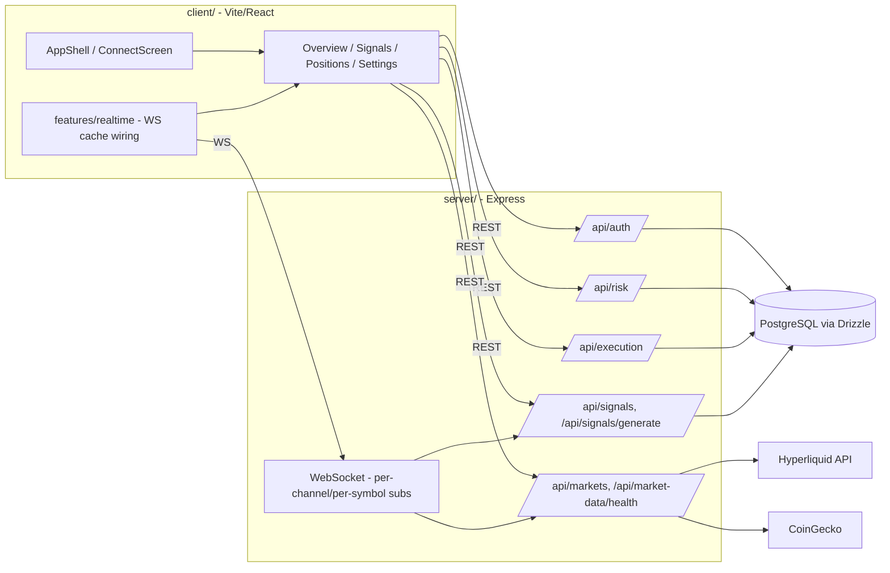

# Current-State Architecture — 2026-07-31

This documents what is actually implemented and wired together as of `origin/main`
(PR #17 merged), verified by reading route registration and directory structure directly
rather than inferring from `TARGET_ARCHITECTURE.md` (which is the *target*, written
2026-07-28 before most of the build-out below existed) or the README (stale — still says
"a client folder is not included in this repository").

## Runtime shape

Two independently deployed/built Node packages, no shared root workspace:

```
LiquidAlpha-github/
├── server/   Express 4 + ws, Drizzle ORM/PostgreSQL, Zod validation, vitest
└── client/   Vite 6 + React 18, TanStack Query, Radix/shadcn, Tailwind, wouter
```

## Server (`server/src/server.ts` entrypoint)

Middleware chain: CORS (explicit allow-list) → `express.json()` → `cookie-parser` →
`/api` rate limiter (`express-rate-limit`) → domain routers.

Mounted routers:
- `/api/auth` → `auth/router.ts` — wallet-signature auth (nonce issue/verify, session
  cookie, revocation), per migration step 5.
- `/api/risk` → `risk/` — limits and kill-switch domain (PR #13's own title says "not yet
  wired to execution" at the time it landed; **confirmed wired as of `origin/main`** —
  `execution/paperEngine.ts` calls `isGloballyHalted`/`isUserHalted` (kill switch),
  `getOrCreateRiskLimits`, and `evaluateTrade` before accepting an order, and rejects the
  order with the failure reason if the check fails. PR #14 completed the wiring PR #13
  left open.).
- `/api/execution` → `execution/` — paper-trading orders/positions with idempotency
  (`(user_id, idempotency_key)` unique constraint) and risk gating (PR #14).

Inline (not yet router-extracted) endpoints on `server.ts` directly:
- `GET /api/markets`, `GET /api/market-data/health` — market-data ingestion + staleness
  (`market-data/` module, PR #9).
- `GET /api/websocket/metrics` — connection/subscription observability for the WS layer
  (`websocket/` module, PR #11 — real per-channel/per-symbol subscriptions, not global
  broadcast).
- `GET /api/signals` (paginated, Zod-validated query), `POST /api/signals/generate`
  (Zod-validated body) — evidence-preserving signal engine (PR #12).
- `GET /api/stats`, `GET /api/funding/:symbol` (Zod-validated params).

Cross-cutting: `middleware/requireAuth.ts`, `middleware/rateLimit.ts`,
`config/env.ts` (boot-time env validation, PR #5), `schemas/` (shared Zod contracts,
PR #6), `db/schema.ts` (Drizzle schema, hardened FKs/indexes/enums, PR #8).

## Client (`client/src/`)

- `app/App.tsx`, `app/AppShell.tsx`, `app/ConnectScreen.tsx` — auth-gated shell and
  wallet-connect entry (PR #15).
- `routes/` — `OverviewPage`, `SignalsPage`, `PositionsPage`, `SettingsPage` (+
  `nav.ts` for route/nav config). No dedicated Analytics route yet — this is the
  outstanding "3rd of 3" client PR referenced in PR #17's description and in
  `docs/migration/REPLIT_TO_GITHUB_PLAN.md` step 14/15.
- `features/{auth,execution,markets,positions,realtime,risk,settings,signals}/` —
  feature-scoped hooks and logic (the pattern the migration plan explicitly modeled on
  Replit's `features/trade`/`features/markets` shape, minus the duplication issues
  found there).
- `features/realtime/` — WebSocket cache wiring into TanStack Query (PR #16), the
  mechanism by which live market/signal updates reach the UI without a second polling
  path.
- `components/ui/` — Radix + `class-variance-authority`/`tailwind-merge` design-system
  primitives (shadcn-style), reused across features rather than each feature owning its
  own controls.

## What is NOT yet true (do not assume otherwise)

- No client test framework — CI's client job explicitly skips a test step today.
- No lint configuration in either package — CI explicitly warns and skips.
- No observability layer (structured logs, request IDs, metrics beyond the two ad-hoc
  `/api/market-data/health` and `/api/websocket/metrics` endpoints) — migration step 16.
- No analytics-integrity work yet (migration step 15) — no analytics UI exists to audit.
- No dedicated security test suite (migration step 17) beyond whatever unit coverage
  exists inside `auth/`, `risk/`, `execution/` today.
- (Risk-to-execution wiring was checked directly in `paperEngine.ts` and confirmed live
  — see above. Not a gap.)

## Diagram



Plain-language: the client never talks to Postgres, Hyperliquid, or CoinGecko directly —
everything routes through the Express API or the WebSocket layer, which is itself fed by
the market-data and signals modules. Auth, risk, and execution are separate routers so
that authorization and risk gating happen server-side before any order write, not as a
client-side check.
